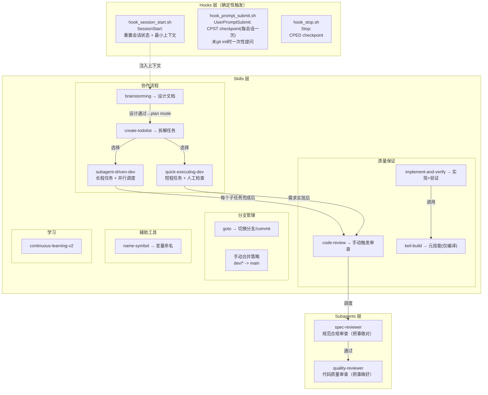
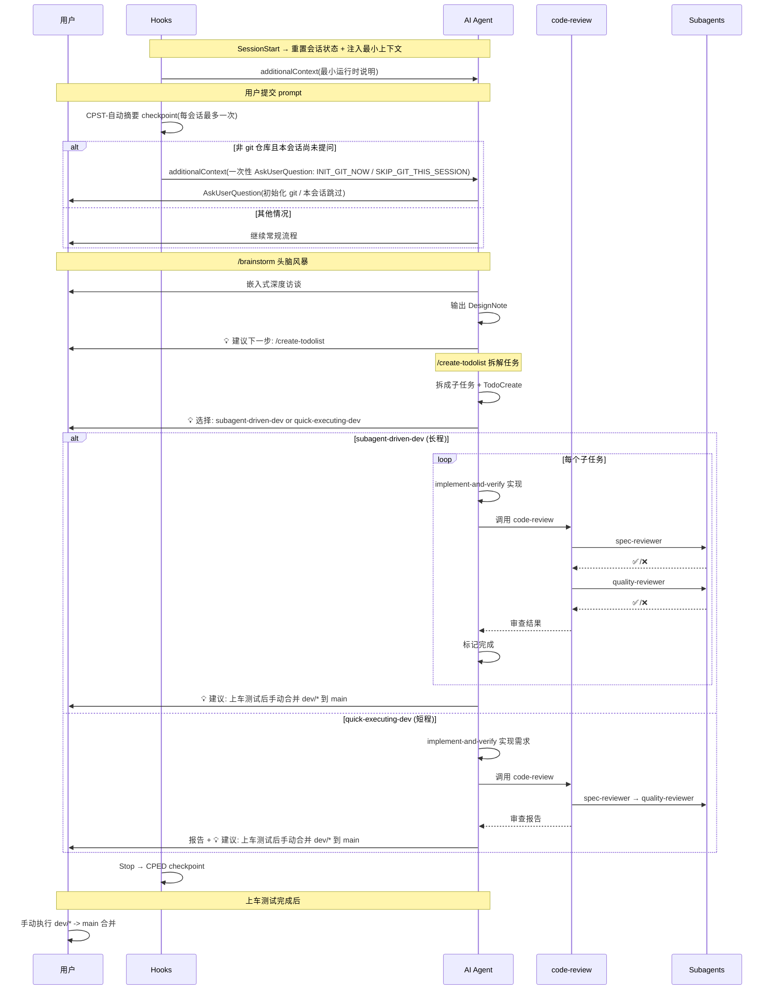

# AI辅助嵌入式开发工作流系统 — 设计框架 v7

> 基于 Superpowers 4.3.1 大修大改，融合自定义分支管理方案。
>
> **语言规范**:
> 1) 文件路径可包含中文；
> 2) AI 可见的提示词（skills/agents/hooks 注入）必须使用准确英文，并尽量节省 token；
> 3) 报告模板必须使用中文；
> 4) 所有最终输出报告（如 ReviewReport）必须为全中文。

---

## 一、系统架构总览



---

## 二、现状 → 目标对照

### 删除项

| 删除目标 | 原因 |
|----------|------|
| `session-git-map.json` + session-branch 映射功能 | 不保留此功能 |
| `.claude/agent-memory/code-reviewer/` | 旧记忆目录，不再保留 |
| `hook_pre_tool.sh` | checkpoint 已在 prompt_submit 和 stop 保证 |
| `hook_pre_tool_branch_guard.sh` | 分支强阻断策略已移除，改为最小会话自动提交流程 |
| `hook_task_complete.sh` | 仅保留会话开始/结束自动提交，不再做 TASK checkpoint |
| `rules/git-harness-agent-policy.md` | 旧强管控策略下线，避免额外上下文开销 |
| `fork-explore` skill | 暂不使用 |
| `writing-skills` skill | 暂不添加 |
| `dispatching-parallel-agents` skill | 整合到 subagent-driven-dev |
| Superpowers: `test-driven-development` | 嵌入式无法 TDD |
| Superpowers: `systematic-debugging` | 调试依赖人工 |
| Superpowers: `verification-before-completion` | 合并到 implement-and-verify |
| Superpowers: `using-git-worktrees` | 用 hooks 替代 |
| Superpowers: `using-superpowers` | 不保留入门引导 |

### 新建/适配项

| Superpowers 原名 | 目标名称 | 处理 |
|------------------|----------|------|
| `brainstorming` | `brainstorming` | 适配嵌入式 |
| `writing-plans` | `create-todolist` | 重命名，保留拆解大任务功能 |
| `subagent-driven-development` + `dispatching-parallel-agents` | `subagent-driven-dev` | 合并，含并行调度 |
| `executing-plans` | `quick-executing-dev` | 重命名 |
| `finishing-a-development-branch` + `merge` + `requesting-code-review`(合并部分) | 手动合并策略 | 并入工作流规则 |
| `code-reviewer` agent | 拆为 `spec-reviewer` + `quality-reviewer` | 两个独立 subagent，由 code-review skill 调度 |
| — | `implement-and-verify` | 新建，合并 TDD+验证核心 |

---

## 三、Hooks 详细设计

> 官方文档确认：Stop payload 含 `last_assistant_message`，UserPromptSubmit 含 `prompt`，SessionStart 支持 `additionalContext` 上下文注入。

### 3.1 `hook_session_start.sh` — 重置会话状态 + 最小上下文注入

- 会话开始时调用 `auto-commit.py` 的 `session_start` 事件，重置会话状态文件 `git-session-state.json`。
- 仅注入最小运行时说明，避免加载大段 workflow/policy 文本。
- **输出格式**:

  ```json
  {
    "hookSpecificOutput": {
      "hookEventName": "SessionStart",
      "additionalContext": "Runtime hooks active: CPST/CPED ..."
    }
  }
  ```

### 3.2 `hook_prompt_submit.sh` — CPST 自动提交 + 未 git init 一次性提问

**Checkpoint 功能**:

- 事件：`UserPromptSubmit`。
- 若当前目录已 `git init`，并且本会话尚未执行过起始 checkpoint，则执行一次 `CPST-` 自动提交。
- 若无代码变更，不提交。

**未 git init 处理**:

- 当检测到当前目录未 `git init` 且本会话尚未提问时，注入强制说明：
  - 先调用 AskUserQuestion。
  - 选项 1：`INIT_GIT_NOW`（立即初始化 git）。
  - 选项 2：`SKIP_GIT_THIS_SESSION`（本会话跳过 git）。
- 一旦完成首次提问，本会话后续 PromptSubmit 不再重复询问。

### 3.3 `hook_stop.sh` — 新建

- payload 字段: `last_assistant_message`。
- 会话结束时若存在未提交更改，执行一次 `CPED-` 自动提交。
- 若无代码变更，不提交。

### 3.4 提交信息拼接规则（连字符统一）

- 自动 checkpoint 提交信息采用统一拼接格式：`<PREFIX-> + <Conventional Commit suffix>`
  - Prefix（由 hooks 自动注入）: `CPST-` / `CPED-`
  - Suffix（短中文 Conventional Commit）: `<type>: <中文简述>`
- 示例：`CPED-` + `chore: 更新hooks自动提交流程（新增0修改3删除0重命名0）`。
- 职责边界：
  - hooks 负责 checkpoint 触发与前缀拼接。
  - 后缀优先使用外部传入（`COMMIT_SUFFIX` 或 `commit_suffix.txt`），否则根据 staged diff 自动生成短中文 Conventional Commit。
  - 手动触发 `/commit` 不自动添加 CP 前缀。

### 3.5 settings.json hooks 配置

```json
{
  "hooks": {
    "SessionStart": [{ "matcher": "startup|resume|clear|compact",
      "hooks": [{ "type": "command", "command": "bash -lc 'if [ -f \".claude/hooks/hook_session_start.sh\" ]; then bash \".claude/hooks/hook_session_start.sh\"; else bash \"hooks/hook_session_start.sh\"; fi'" }] }],
    "UserPromptSubmit": [{
      "hooks": [{ "type": "command", "command": "bash -lc 'if [ -f \".claude/hooks/hook_prompt_submit.sh\" ]; then bash \".claude/hooks/hook_prompt_submit.sh\"; else bash \"hooks/hook_prompt_submit.sh\"; fi'" }] }],
    "Stop": [{
      "hooks": [
        { "type": "command", "command": "bash -lc 'if [ -f \".claude/hooks/hook_stop.sh\" ]; then bash \".claude/hooks/hook_stop.sh\"; else bash \"hooks/hook_stop.sh\"; fi'", "async": true },
        { "type": "command", "command": "bash -lc 'if [ -f \".claude/hooks/windows_notification.ps1\" ]; then powershell -NoProfile -ExecutionPolicy Bypass -File \".claude/hooks/windows_notification.ps1\" -Title \"Copilot Hooks\" -EventType stop; else powershell -NoProfile -ExecutionPolicy Bypass -File \"hooks/windows_notification.ps1\" -Title \"Copilot Hooks\" -EventType stop; fi'", "async": true }
      ] }],
    "PreToolUse": [
      { "matcher": "*",
        "hooks": [{ "type": "command", "command": "bash -lc 'if [ -f \".claude/hooks/memory-observe.sh\" ]; then bash \".claude/hooks/memory-observe.sh\" pre; else bash \"hooks/memory-observe.sh\" pre; fi'", "async": true }] }
    ],
    "PostToolUse": [{ "matcher": "*",
      "hooks": [{ "type": "command", "command": "bash -lc 'if [ -f \".claude/hooks/memory-observe.sh\" ]; then bash \".claude/hooks/memory-observe.sh\" post; else bash \"hooks/memory-observe.sh\" post; fi'", "async": true }] }]
  }
}
```

> **会话状态文件**: `git-session-state.json`（仓库根目录）
>
> 记录字段：`git_init_prompted`、`git_init_decision`、`start_commit_done`、`session_marker`、`updated_at`。

### 3.6 continuous-learning-v2 hooks（v2.1 实现态）

- **`memory-observe.sh`（已落地）**:
  - 绑定于 `PreToolUse` / `PostToolUse`，分别写入 `tool_start` / `tool_complete` 事件。
  - 从 hook payload 提取 `cwd`，优先作为 `CLAUDE_PROJECT_DIR`，保证在 `.claude` 子模块内运行时仍能识别宿主项目。
  - 观测数据写入 `<project_root>/ProjectMemory/<project-hash>/observations.jsonl`；无项目上下文时回落到 `.claude/GlobalMemory`。
  - 单文件达到阈值（10MB）自动归档到 `observations.archive/`。
- **`memory-detect-project.sh`（已落地）**:
  - 项目识别顺序：`CLAUDE_PROJECT_DIR` → `git rev-parse --show-toplevel` → global fallback。
  - 使用 `git remote get-url origin`（或路径回退）计算 12 位项目哈希。
  - 自动维护 `.claude/GlobalMemory/projects.json`（项目 registry，含 `name/root/remote/last_seen`）。
- **Windows 兼容策略（已落地）**:
  - 所有 memory 相关脚本统一采用“实际执行检测”选择 Python：优先 `python3 -c` 可执行，再回退 `python -c`。

> 说明：当前实现仅在 SessionStart/UserPromptSubmit 注入最小上下文，不再加载分支强管控策略文件。

---

## 四、Skills 详细设计

### 4.1 协作流程

#### `brainstorming`（从 Superpowers 适配）

- 增加嵌入式深度访谈阶段
- 如有相关控制理论参考资料，提醒用户提供（不自动搜索）
- 接口签名定义阶段引用 `name-symbol` skill
- 输出 → `References/DesignNote/YYYY-MM-DD-<topic>-design.md`
- **独立可调用**: 用户可单独使用 `/brainstorm` 只做设计
- **下一步建议**: 执行完成后给出明确指引 → 建议进入 plan mode 调用 `create-todolist`

#### `create-todolist`（重命名自 `writing-plans`）

- **保留原 writing-plans 核心功能**: 将大任务合理拆成合适的子任务（2-5分钟粒度），含完整文件路径、代码、验证步骤
- 使用官方 Todo 工具（`TaskCreate/TaskGet/TaskList/TaskUpdate`）
- **输出格式: JSON 文件**（非 md）
  - 路径: `References/PlanPrompt/YYYY-MM-DDThh-mm-<功能简述>.json`
  - 每个 task 独立条目，含任务说明、验收标准、文件路径、接口签名期望——供 spec-reviewer 脚本精准读取
- 任务步骤: 实现（implement-and-verify）→ keil-build → 可选 unit test
- **创建完成后自动初始化**:
  - 写入 `.claude/plan-git-SHA.json`（初始化新 plan 条目，base/head SHA 均设为当前最新提交）
- **独立可调用**: 用户可单独使用 `/create-todolist`
- **下一步建议**: 执行完成后提供 **subagent-driven-dev** vs **quick-executing-dev** 两种选择

**PlanPrompt JSON 示例**:

```json
{
  "plan_id": "YYYY-MM-DDThh-mm-<功能简述>",
  "description": "<该计划的核心目标描述，例如：实现机器人底盘LQR姿态控制算法>",
  "created_at": "YYYY-MM-DDThh:mm:ss+08:00",
  "tasks": [
    {
      "id": "Task_1",
      "name": "<子任务名称，简洁明确，例如：初始化底盘姿态传感器>",
      "description": "<子任务详细说明，包括要完成的具体操作、业务逻辑等>",
      "acceptance_criteria": [
        "<验收标准1，可量化，例如：编译通过 0 Error(s) 0 Warning(s)>",
        "<验收标准2，例如：MPU6050初始化函数返回值为0（成功）>",
        "<验收标准3，例如：姿态数据采样频率稳定在100Hz>"
      ],
      "files_to_modify": [
        "<待修改文件路径1，例如：Src/chassis_sensor.c>",
        "<待修改文件路径2，例如：Inc/chassis_sensor.h>"
      ],
      "interface_specs": {
        "functions": [
          "<函数签名1，例如：int MPU6050_Init(void)>",
          "<函数签名2，例如：void Chassis_Attitude_Sample(void)>"
        ],
        "structs": [
          "<结构体定义1，例如：ST_ChassisAttitude_t>",
          "<结构体定义2，例如：ST_MPU6050_Config_t>"
        ],
        "macros": [
          "<宏定义，可选，例如：#define MPU6050_SAMPLE_FREQ 100>"
        ],
        "enums": [
          "<枚举定义，可选，例如：ENUM_MPU6050_ErrorStatus_t>"
        ]
      }
    },
    {
      "id": "Task_2",
      "name": "<子任务名称，例如：实现LQR控制核心算法>",
      "description": "<子任务详细说明，例如：基于状态空间方程推导LQR增益矩阵，编写姿态控制计算函数>",
      "acceptance_criteria": [
        "<验收标准1，例如：LQR增益矩阵计算结果与理论值偏差≤5%>",
        "<验收标准2，例如：Chassis_LQR_Calc函数输出符合预期姿态指令>",
        "<验收标准3，例如：无内存越界、栈溢出风险>"
      ],
      "files_to_modify": [
        "<待修改文件路径，例如：Src/chassis_control.c>"
      ],
      "interface_specs": {
        "functions": [
          "<函数签名，例如：void Chassis_LQR_Calc(ST_ChassisAttitude_t *att, ST_ChassisCmd_t *cmd)>"
        ],
        "structs": [
          "<结构体定义，例如：ST_LQR_Params_t>"
        ],
        "global_vars": [
          "<全局变量，可选，例如：float LQR_K_Gain[4][2]>"
        ]
      }
    },
    {
      "id": "Task_3",
      "name": "<子任务名称，例如：集成测试与验证>",
      "description": "<子任务详细说明，例如：将传感器数据接入LQR算法，验证闭环控制效果>",
      "acceptance_criteria": [
        "<验收标准1，例如：底盘姿态误差≤±0.5°>",
        "<验收标准2，例如：keil-build编译无错误>",
        "<验收标准3，例如：无运行时断言失败>"
      ],
      "files_to_modify": [
        "<待修改文件路径，例如：Src/chassis_main.c>"
      ],
      "interface_specs": {
        "functions": [
          "<函数签名，例如：void Chassis_Control_Loop(void)>"
        ]
      }
    }
  ]
}
```

#### `subagent-driven-dev`

（合并 Superpowers `subagent-driven-development` + `dispatching-parallel-agents`）

- **长程任务**: 人工监管弱，高效审查机制保护
- 含并行子智能体调度能力（从 dispatching-parallel-agents 整合）
- 每个子任务完成 → **调用 `code-review` skill** → code-review 负责调度 spec-reviewer 和 quality-reviewer
- 完成标准: keil-build `0 Error(s)`
- **不自动连接合并技能**，用户按当前 git 逻辑手动合并
- **独立可调用**: 用户可直接使用（需有 plan）
- **下一步建议**: 全部完成后建议上车测试，随后手动合并 `dev/*` 到 `main`
- 含 `skills/subagent-driven-dev/implementer-prompt.md` 模板
- **子智能体开启全部可用能力**: implementer subagent 需要在 SKILL.md 中配置开启所有工具权限（`allowed_tools: all`），使其能访问所有文件、执行命令、读写代码

#### `quick-executing-dev`（重命名自 `executing-plans`）

- **短程任务**: 人工强监管，快速编写
- 需求实现后 → **调用 `code-review` skill** → 审查流程同上
- 其余逻辑保持：批次执行 + 人工检查点
- **独立可调用**: 用户可直接使用（需有 plan）
- **下一步建议**: 完成后建议上车测试，随后手动合并 `dev/*` 到 `main`

### 4.2 质量保证

#### `implement-and-verify`（新建）

- subagent-driven-dev 和 quick-executing-dev 调用此技能进行代码实现
- AI 目标: 产出符合代码库风格、自解释的高质量代码
- 验证: keil-build `0 Error(s)` + 可选 unit test
- 保留 YAGNI、DRY、最小实现
- 声称完成前必须有编译证据

#### `code-review`（现有 → 升级为审查调度中心）

- **调度职责**: 接收审查请求 → 依次调度 spec-reviewer 和 quality-reviewer subagent
  - 强制顺序: spec-reviewer 先行 → 通过后 → quality-reviewer
  - 两个审查都通过才算审查完成
- **被调用场景的详细逻辑**（写入 SKILL.md）:
  - **subagent-driven-dev 调用**: 每完成一个子任务就调用 → 先 spec-reviewer 再 quality-reviewer → 两者都通过才标记完成
  - **quick-executing-dev 调用**: 需求整体实现后调用 → 同流程 → 目的是减少审查、快速编写
- **SHA 范围确定**（读取 `plan-git-SHA.json`）:
  - 读取当前分支上最新 `in progress` 的 plan
  - 对于 **plan 级审查**: `base = base_plan_sha`, `head = 当前最新提交`
  - 对于 **task 级审查**: `base = 同 plan 下上一个已完成 task 的 head_sha`（按 completed_at 排序），`head = 当前最新提交`；若为第一个 task 则 `base = base_plan_sha`
  - 执行 `git diff --stat {BASE}..{HEAD}` 框定审查范围
- **无法匹配时的 fallback**: 调用 AskUserQuestion 询问用户，问题包括:
  1. 「当前分支上没有进行中的 plan。你想审查哪个范围？(a) 输入两个 git SHA (b) 审查最近 N 次提交 (c) other」
  2. 若选 (a): 「请提供 BASE_SHA 和 HEAD_SHA」
  3. 若选 (b): 「要审查最近几次提交？」
- 保留现有嵌入式审查规范作为参考
- 合并 `receiving-code-review` 的反馈处理
- **独立可调用**: 用户手动 `/code-review` 也可触发

#### `keil-build`（现有 → 改造为元技能）

- **仅进行编译操作 + 返回编译输出**
- 删除循环编译修复部分（Round 1-8）
- 删除"只修编译错误不改业务逻辑"约束
- 最大化执行速度：去掉所有不必要的检查

### 4.3 分支管理

#### `goto`（保留现有）

#### 手动合并策略（当前规则）

- `main` 仅保存上车调试后的稳定版本。
- 每位开发者维护一个按人命名的 `dev/*` 分支，不按功能拆分分支。
- 新功能若依赖他人代码，先手动合入对方 `dev/*` 分支作为基础。
- 默认不依赖 Pull Request 流程，变更通过 git 提交历史追踪。
- 上车测试通过后，用户手动将当前 `dev/*` 分支合并到 `main`。

### 4.4 辅助工具

#### `name-symbol`（保留现有）

### 4.5 学习

#### `continuous-learning-v2`（保留并升级到 v2.1）

- **解耦状态（已完成）**:
  - 活跃 hook/agent 入口采用双路径兼容：优先 `.claude/hooks/` 与 `.claude/agents/`，回退到当前目录 `hooks/` 与 `agents/`。
- **存储架构（已完成）**:
  - Global：`.claude/GlobalMemory/`
  - Project：`<project_root>/ProjectMemory/<project-hash>/`
  - 默认作用域为 `project`，`global` 仅用于跨项目通用模式。
- **命令能力（v2.1 已对齐）**:
  - `/instinct-status`、`/evolve`、`/instinct-export`、`/instinct-import`
  - `/promote`（项目记忆提升为全局）
  - `/projects`（查看跨项目 registry 与统计）

---

## 五、Subagents 详细设计

### 5.1 `spec-reviewer` (新建)

- **位置**: `.claude/agents/spec-reviewer.md`
- **职责**: "把事情做对" — 检查代码实现是否与计划要求一致
- **计划定位流程**:
  1. 读取 `.claude/plan-context.json` 获取 `active_plan` 路径（JSON PlanPrompt 文件）
  2. 读取 JSON 中当前 task 的 `acceptance_criteria`、`interface_specs`、`files_to_modify`
  3. 通过 `plan-git-SHA.json` 确定审查 git 范围（BASE/HEAD SHA）
- **审查内容**:
  - 对照 task 的 `acceptance_criteria` 检查功能完整性
  - 对照 `interface_specs` 检查接口签名一致性
  - 识别计划外的额外添加（scope creep）
  - 识别缺失的计划内功能
- **引用**: `naming-rules.md` + 由 `plan-context.json` 指向的 PlanPrompt JSON 文件

### 5.2 `quality-reviewer` (新建)

- **位置**: `.claude/agents/quality-reviewer.md`
- **职责**: "把事情做好" — 检查代码实现的规范性和质量
- **审查内容**:
  - 代码质量、函数设计、变量使用
  - 嵌入式特有审查（volatile、可重入性、栈溢出等）
  - 文件管理、注释规范、排版格式
- **引用**: `developing-styles.md`（代码实现规范附件）

### 5.3 审查报告输出

- **将全部审查输出写入 SKILL.md**
- **失败才生成文件**：审查不通过时输出 Markdown 报告，审查通过则口头报告结果即可
- **输出目录**: `References/ReviewReport/<plan-id>/`
  - spec-reviewer 失败生成: `SPEC-<计划文件名>.md`
  - quality-reviewer 失败生成: `QLTY-<计划文件名>.md`
  - 例: `References/ReviewReport/2026-03-02T14-30-LQR-Control/SPEC-2026-03-02T14-30-LQR-Control.md`
- **报告模板**: 分别创建 `spec-review-tpl.md` 和 `qlty-review-tpl.md`
  - 位置: `.claude/skills/code-review/`
  - 参考 Superpowers `requesting-code-review/code-reviewer.md` 格式（优势 / 问题 / 结论结构）
  - 模板正文必须使用中文字段与中文章节标题
  - spec 模板加入对照 plan 的欺差展示模块
  - qlty 模板加入嵌入式规范欺差展示模块
- 生成后提示用户进行进一步审核

### 5.4 调用链路

```
subagent-driven-dev ──┐
                      ├──→ code-review skill ──→ spec-reviewer ──(通过)──→ quality-reviewer
quick-executing-dev ──┘
用户手动 /code-review ───→ code-review skill ──→ spec-reviewer ──(通过)──→ quality-reviewer

```

- **code-review** 是调度中心，负责决定调用哪些 subagent
- spec-reviewer 必须通过后才进入 quality-reviewer
- 两者都通过才标记审查完成

---

## 六、规范参考附件设计

从以下源文件提取，按权重排序：

**权重**: `ReadMe.txt` + `模板.txt` > `华为C语言编程规范.md` > `Google C++ Style Guide.md`

### 6.1 `naming-rules.md`（命名规范）

- **位置**: `skills/code-review/naming-rules.md`（供 spec-reviewer 引用）
- **内容**: 函数/变量/结构体等接口签名的命名规范
- **结构**:
  - `## 项目命名规范（ReadMe.txt 提取）` ← 单独声明块，方便修改
  - `## 华为C规范 — 命名相关`
  - `## Google C++ — 命名相关`

### 6.2 `developing-styles.md`（代码实现规范）

- **位置**: `skills/code-review/developing-styles.md`（供 quality-reviewer 引用）
- **内容**: 代码实现规范、风格、质量要求
- **结构**:
  - `## 项目规范（ReadMe.txt + 模板.txt 提取）` ← 单独声明块
  - `## 华为C规范 — 代码质量`
  - `## Google C++ — 代码风格`

---

## 七、完整工作流序列



> **设计原则**: 所有 skill 均可独立调用。使用完整流程时，每步执行后给出下一步建议（💡），但不强制跳转。

---

## 八、目标文件结构

```
.claude/
├── settings.json              # 权限 + hooks 事件绑定（含 continuous-learning-v2 hooks）
├── settings.local.json        # 本地权限
├── GlobalMemory/              # [已落地] 全局记忆根目录
│   ├── projects.json           # project-hash registry
│   ├── instincts/
│   │   ├── personal/
│   │   └── inherited/
│   └── evolved/
│       ├── skills/
│       ├── commands/
│       └── agents/
├── plan-context.json          # [新建] 当前激活计划路径
├── plan-git-SHA.json          # [新建] plan/task git SHA 追踪
├── git-session-state.json     # [新建] 会话态：git_init_prompted/start_commit_done
├── hooks/
│   ├── hook_session_start.sh  # [重写] 重置会话状态 + 最小上下文注入
│   ├── hook_prompt_submit.sh  # [改造] CPST 签名 + 未git init一次性提问
│   ├── hook_stop.sh           # [新建] CPED 签名
│   ├── auto-commit.py         # [新增] 统一前缀拼接与自动提交入口（CPST-/CPED-）
│   ├── memory-observe.sh      # [新建] v2.1 观测入口（pre/post）
│   ├── memory-detect-project.sh # [新建] v2.1 项目识别与registry更新
│   └── windows_notification.ps1 # [新增] 项目内 Windows 通知 hook
├── rules/
│   └── workflow-guide.md      # [新建] 推荐工作流说明（英文）
├── agents/
│   ├── spec-reviewer.md       # [新建] 规范合规审查（英文）
│   ├── quality-reviewer.md    # [新建] 代码质量审查（英文）
│   ├── memory-observer.md     # [新建] v2.1 记忆观察 agent
│   ├── start-memory-observer.sh # [新建] 启停脚本
│   └── memory-detect-project.sh # [新建] 供 agent 复用的项目识别脚本
├── skills/
│   ├── brainstorming/SKILL.md           # [新建]（英文）
│   ├── create-todolist/SKILL.md         # [新建]（英文）
│   ├── subagent-driven-dev/             # [新建]
│   │   ├── SKILL.md                     #（英文）
│   │   └── implementer-prompt.md        #（英文）
│   ├── quick-executing-dev/SKILL.md     # [新建]（英文）
│   ├── implement-and-verify/SKILL.md    # [新建]（英文）
│   ├── code-review/                     # [升级] 审查调度中心
│   │   ├── SKILL.md                     #（英文）
│   │   ├── naming-rules.md              # 命名规范（英文）
│   │   ├── developing-styles.md         # 代码实现规范（英文）
│   │   ├── spec-reviewer-prompt.md      # spec-reviewer 调用提示词（英文）
│   │   ├── quality-reviewer-prompt.md   # quality-reviewer 调用提示词（英文）
│   │   ├── spec-review-tpl.md           # [新建] SPEC 报告模板（中文）
│   │   └── qlty-review-tpl.md           # [新建] QLTY 报告模板（中文）
│   ├── keil-build/                      # [改造] 元技能
│   │   ├── SKILL.md                     #（英文）
│   │   └── scripts/
│   ├── goto/SKILL.md                    # [保留]
│   ├── name-symbol/                     # [保留]
│   └── continuous-learning-v2/          # [保留]
├── worktrees/

<project-root>/
└── ProjectMemory/
  └── <project-hash>/
    ├── observations.jsonl
    ├── observations.archive/
    ├── instincts/
    │   ├── personal/
    │   └── inherited/
    └── evolved/
      ├── skills/
      ├── commands/
      └── agents/
```

**删除项**: `hook_pre_tool.sh`, `session-git-map.json`, `agent-memory/code-reviewer/`, `fork-explore/`, `agents/`(旧空目录)

### `plan-git-SHA.json` 格式（完整示例）

```json
{
  "git_branch": "work/lqr-control",
  "plans": [
    {
      "metadata": {
        "plan_id": "2026-03-02T14-30-LQR-Control",
        "created_at": "2026-03-02T14:30:00+08:00",
        "status": "in_progress"
      },
      "paths": {
        "plan_file_path": "References/PlanPrompt/2026-03-02T14-30-LQR-Control.json"
      },
      "git_sha": {
        "base_plan_sha": "a1b2c3d4e5f6",
        "head_plan_sha": "a1b2c3d4e5f6"
      },
      "tasks": {
        "Task_1": {
          "task_name": "初始化GPIO",
          "status": "completed",
          "completed_at": "2026-03-02T15:00:00+08:00",
          "head_sha": "f6e5d4c3b2a1"
        },
        "Task_2": {
          "task_name": "编写双环PID算法",
          "status": "pending",
          "completed_at": "",
          "head_sha": ""
        },
        "Task_3": {
          "task_name": "集成测试",
          "status": "pending",
          "completed_at": "",
          "head_sha": ""
        }
      }
    }
  ]
}
```

**状态定义**:

- plan: `in_progress` / `completed` 默认为`in_progress`
- task：`pending`/`completed` 默认为`pending`
  - task 状态由开发流程工具更新，hooks 不再在 TaskCompleted 事件改写 task SHA。

- plan/task 进入 `completed` 后 head SHA 冻结不再更新

**写入时机**:

- `create-todolist`: 初始化新 plan 条目（所有 SHA=当前最新提交，所有 task status=pending）
- Task 完成后的 SHA/状态更新由计划执行流程自身维护（不再依赖 TaskCompleted hook 自动改写）

### `settings.json` hooks 配置（含 continuous-learning-v2）

```json
{
  "hooks": {
    "SessionStart": [{ "matcher": "startup|resume|clear|compact",
      "hooks": [{ "type": "command", "command": "bash -lc 'if [ -f \".claude/hooks/hook_session_start.sh\" ]; then bash \".claude/hooks/hook_session_start.sh\"; else bash \"hooks/hook_session_start.sh\"; fi'" }] }],
    "UserPromptSubmit": [{
      "hooks": [{ "type": "command", "command": "bash -lc 'if [ -f \".claude/hooks/hook_prompt_submit.sh\" ]; then bash \".claude/hooks/hook_prompt_submit.sh\"; else bash \"hooks/hook_prompt_submit.sh\"; fi'" }] }],
    "Stop": [{
      "hooks": [
        { "type": "command", "command": "bash -lc 'if [ -f \".claude/hooks/hook_stop.sh\" ]; then bash \".claude/hooks/hook_stop.sh\"; else bash \"hooks/hook_stop.sh\"; fi'", "async": true },
        { "type": "command", "command": "bash -lc 'if [ -f \".claude/hooks/windows_notification.ps1\" ]; then powershell -NoProfile -ExecutionPolicy Bypass -File \".claude/hooks/windows_notification.ps1\" -Title \"Copilot Hooks\" -EventType stop; else powershell -NoProfile -ExecutionPolicy Bypass -File \"hooks/windows_notification.ps1\" -Title \"Copilot Hooks\" -EventType stop; fi'", "async": true }
      ] }],
    "PreToolUse": [
      { "matcher": "*",
        "hooks": [{ "type": "command",
          "command": "bash -lc 'if [ -f \".claude/hooks/memory-observe.sh\" ]; then bash \".claude/hooks/memory-observe.sh\" pre; else bash \"hooks/memory-observe.sh\" pre; fi'",
          "async": true }] }
    ],
    "PostToolUse": [{ "matcher": "*",
      "hooks": [{ "type": "command",
        "command": "bash -lc 'if [ -f \".claude/hooks/memory-observe.sh\" ]; then bash \".claude/hooks/memory-observe.sh\" post; else bash \"hooks/memory-observe.sh\" post; fi'",
        "async": true }] }]
  }
}
```